**Note:** For the screenshots, you can store all of your answer images in the `answer-img` directory.

## Verify the monitoring installation

*DONE:* run `kubectl` command to show the running pods and services for all components. Take a screenshot of the output and include it here to verify the installation  
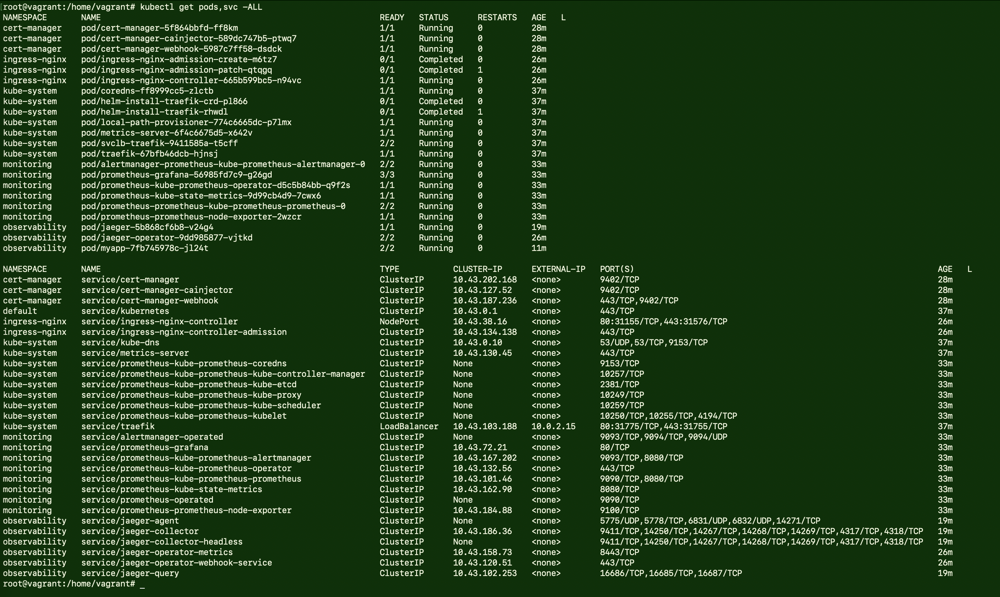

## Setup the Jaeger and Prometheus source
*DONE:* Expose Grafana to the internet and then setup Prometheus as a data source. Provide a screenshot of the home page after logging into Grafana.  
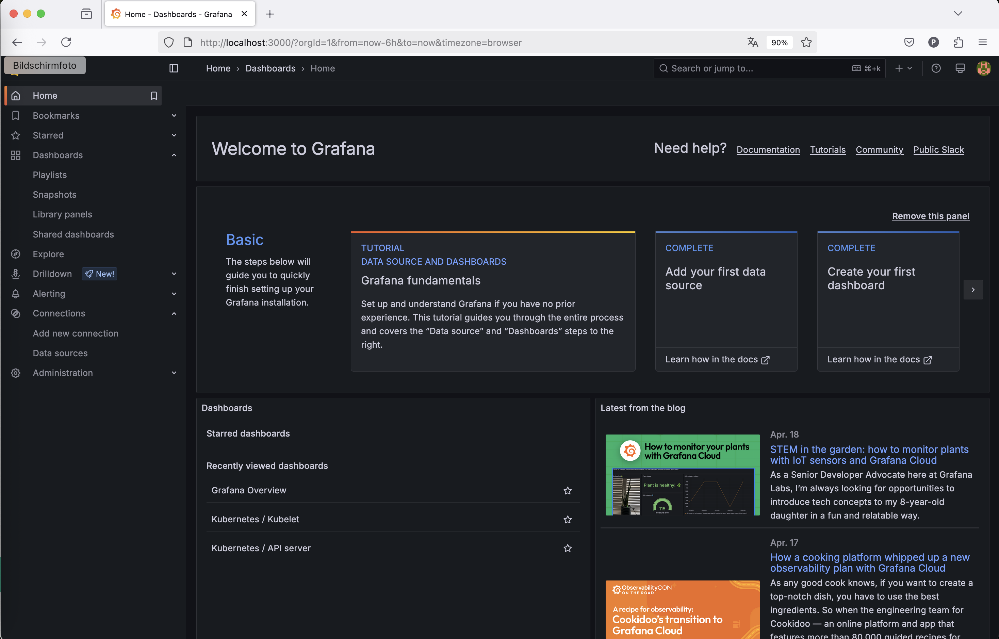  
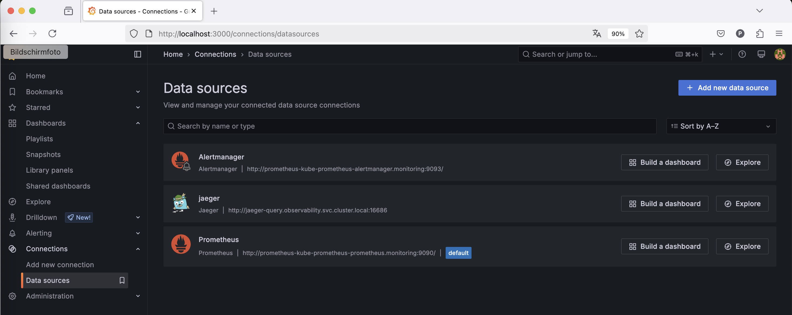

## Create a Basic Dashboard
*DONE:* Create a dashboard in Grafana that shows Prometheus as a source. Take a screenshot and include it here.  
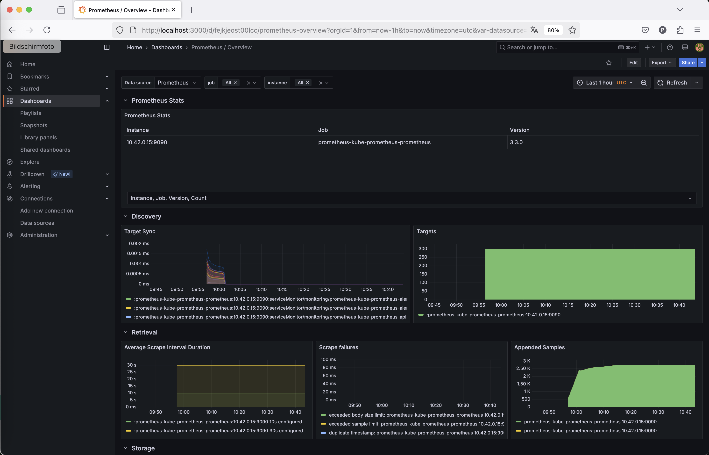

## Describe SLO/SLI
*DONE:* Describe, in your own words, what the SLIs are, based on an SLO of *monthly uptime* and *request response time*.
### SLO: "Monthly Uptime"
* This SLO specifies the target for the percentage of time a service should be available per month.  
* A Service Level Indicator (SLI) is the metric that is measured to determine whether you are achieving this SLO. In other words, a technical or quantifiable indicator.  
* In this case the __SLI__ could be:  
"Availability of the service _in relation_ to the total time in the month, measured as (available minutes / total minutes of the month)."
### SLO: "Request Response time"
* This SLO specifies the response time in a certain period of time.  
* An __SLI__ would be in this case the proportion of requests that are answered within a certain time limit:  
* E.g.: Percentage of requests with a response time of less than 300 ms.

## Creating SLI metrics. (Comment: I think, here are KPI metrics requested!!)
*DONE:* It is important to know why we want to measure certain metrics for our customer. Describe in detail 5 metrics to measure these SLIs. 

* Uptime: Total number of minutes in which the service was available (e.g. health check status 200).
* Downtime: Number of failures or incidents per month.
* Errors: Proportion of requests with error status codes (e.g. 5xx).
* Request duration: 95th percentile of response times: shows how performant the majority of requests were.
* Latency outliers: Number of requests that exceed the time limit (e.g. > 300 ms).

## Create a Dashboard to measure our SLIs
*DONE:* Create a dashboard to measure the uptime of the frontend and backend services. We will also want to measure to measure 40x and 50x errors. Create a dashboard that show these values over a 24 hour period and take a screenshot.  
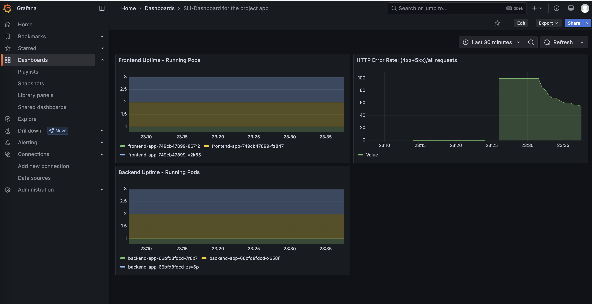
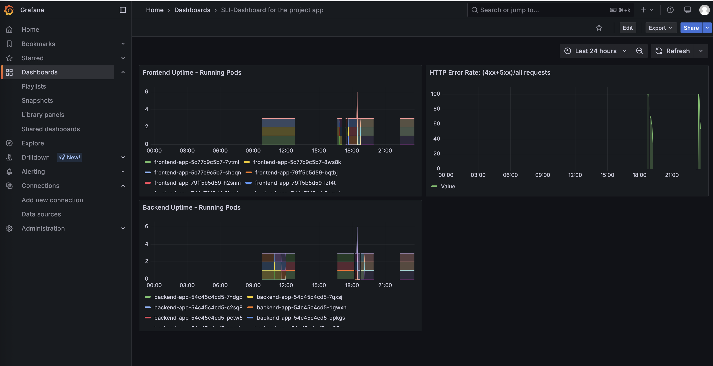  

## Tracing our Flask App
*DONE:*  We will create a Jaeger span to measure the processes on the backend. Once you fill in the span, provide a screenshot of it here. Also provide a (screenshot) sample Python file containing a trace and span code used to perform Jaeger traces on the backend service.
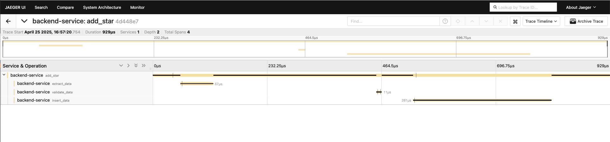
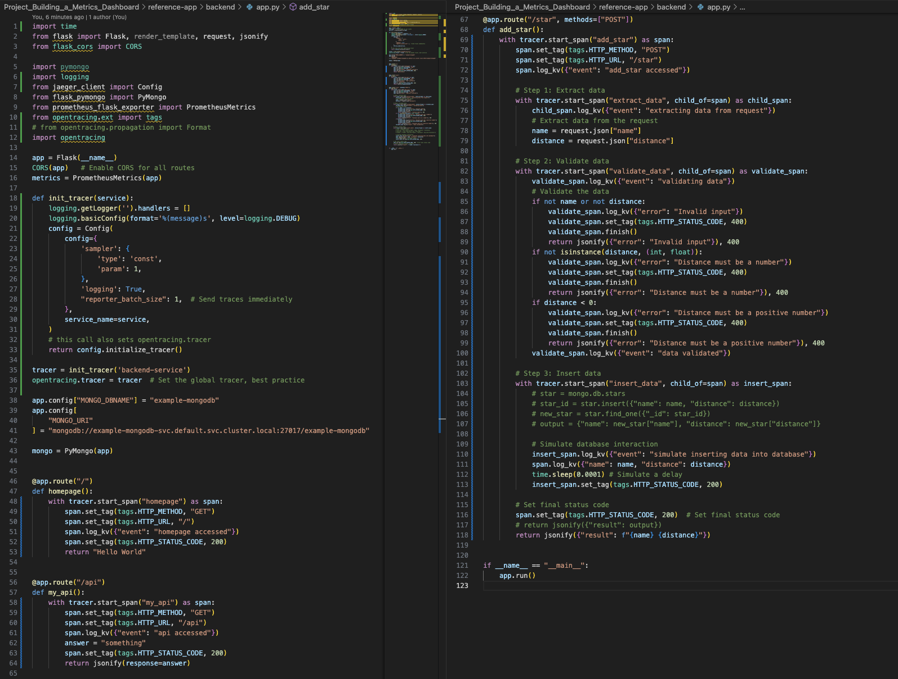

## Jaeger in Dashboards
*DONE:* Now that the trace is running, let's add the metric to our current Grafana dashboard. Once this is completed, provide a screenshot of it here.
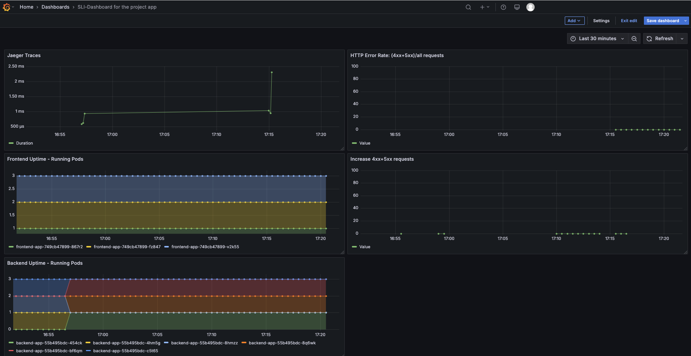

## Report Error
*DONE:* Using the template below, write a trouble ticket for the developers, to explain the errors that you are seeing (400, 500, latency) and to let them know the file that is causing the issue also include a screenshot of the tracer span to demonstrate how we can user a tracer to locate errors easily.

TROUBLE TICKET

Name:
Michael Obst

Date:
25.04.2025

Subject:
Latency issue with the database

Affected Area:
backend-service

Severity:
Medium

Description:
Backend oprations take more and more longer. According to the Jaeger traces the database-operations seem to cause this issue. For an example please see the attached Jaeger trace "add_star": the ‘insert_data’ span takes up almost the entire time of the ‘add_star’ trace. Please check the database.  
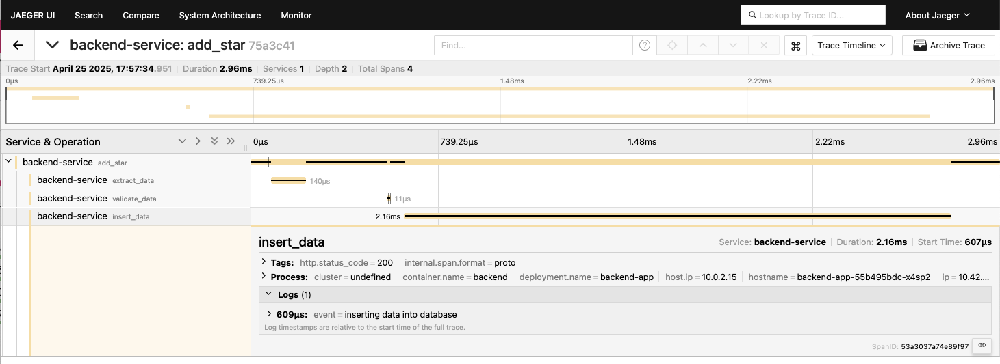

## Creating SLIs and SLOs
*DONE:* We want to create an SLO guaranteeing that our application has a 99.95% uptime per month. Name four SLIs that you would use to measure the success of this SLO.
1. HTTP Requests Rate  
* Definition: Percentage of HTTP requests that returned a 2xx or 3xx status code.
* SLI: Number of successful HTTP requests / total number of http requests * 100

2. Latency
* Definition: Share of HTTP requests served within an acceptable response time (e.g. under 500 milliseconds).
* SLI: Requests with latency < 500ms / total number of requests * 100

3. Availibility
* Definition: Percentage of time that key application endpoints respond successfully (e.g., via health checks).
* SLI: Time endpoint responded successfully / total time in month * 100

4. Infrastructure uptime
* Uptime percentage of critical infrastructure components (e.g., database, load balancer, API gateway).
* SLI: Component uptime / total time in month * 100

## Building KPIs for our plan
*DONE*: Now that we have our SLIs and SLOs, create a list of 2-3 KPIs to accurately measure these metrics as well as a description of why those KPIs were chosen. We will make a dashboard for this, but first write them down here.
1. Monthly Application Uptime (%)
* Definition: Percentage of time during a given month that the application was reachable through key endpoints (e.g., /health).
* Uptime = Available Minutes / Total minutes a month * 100
* Based on SLI 3
* Directly validates the 99.95% SLO, easy to report and easy for SLA verification

2. Error Rate
* Definition: Percentage of failed HTTP requests (e.g., 5xx or 4xx)
* Error Rate = Number of failed requests (4xx, 5xx) / Number of total requests * 100
* Based on SLI 1
* Indicates backend reliability and system health, helps detect issues even when uptime appears normal, helpful for engineering teams during incident response.

3. Average Request Latency
* Definition: The average response time of all HTTP requests over the course of the month (also useful using the 95th percentile).
* Average Latency = Total request time / number of requests
* Based on SLI 2
* Monitors user experience, early warning sign for performance degradation

## Final Dashboard
*DONE*: Create a Dashboard containing graphs that capture all the metrics of your KPIs and adequately representing your SLIs and SLOs. Include a screenshot of the dashboard here, and write a text description of what graphs are represented in the dashboard.  
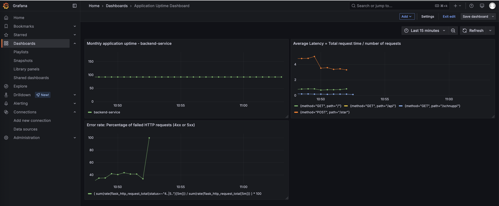
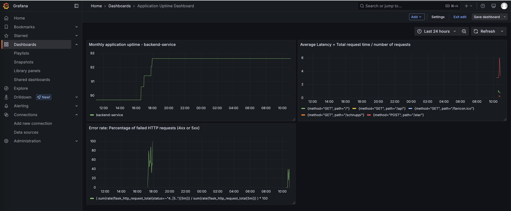

